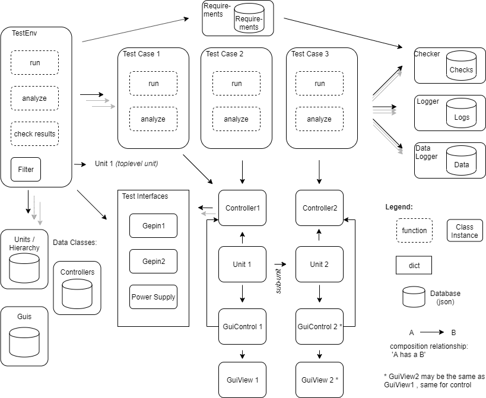

# Testing Framework

The framework has the following functionality:
- Definition of unit hierarchy: A hierarchy of units und subunits for the device under test as well as  units used for testing (e.g. power supply) can be defined
- Definition of test interfaces: A list of interfaces the test cases use need to be defined
- Definition of test cases: A list of test cases (which are itself well defined python classes) can be defined. The test cases has a run, and evaluate method.
- Selection and filtering if test-cases to be run
- Logging of data and text from the test cases
- All data and definitions are stored in data bases
- Configuration and status registers (CSR) definition files
- Automatic GUI generation based on CSR
- Support for requirements management and evaluation
- Automatic reports of test case results and requirements
- All tests run automated without intervention from the user and automatically produced the data and graphs shown in this section

To control the FPGA a memory map protocol is used which we call Gepin (General Purpose Interface). Gepin allows to write and read from addresses. The length of the data to be read/written is variable. For request with length longer than one a flag can be used to set the increase or fixed address mode.  Fixed address mode can for example be used to write to FIFOs.

# Installation

```
pip install pyserial tinydb==3.13.0

```

# Tests and GUI

The test as well as the GUI can be run from `TofTests.py`.

# Class Diagram


